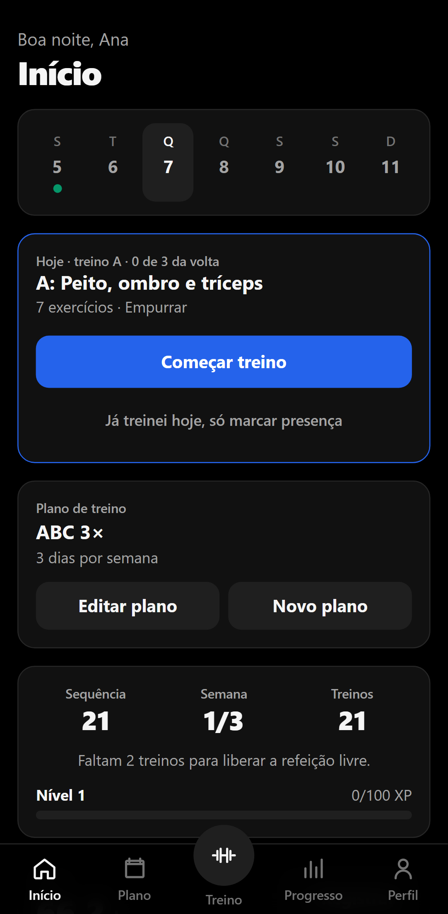
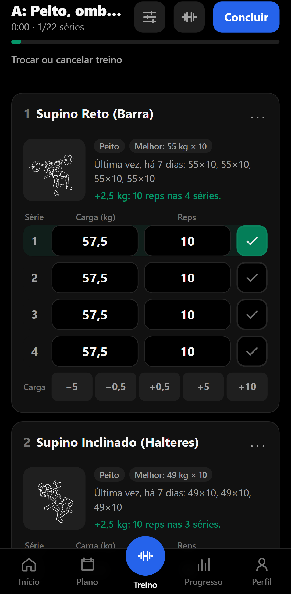
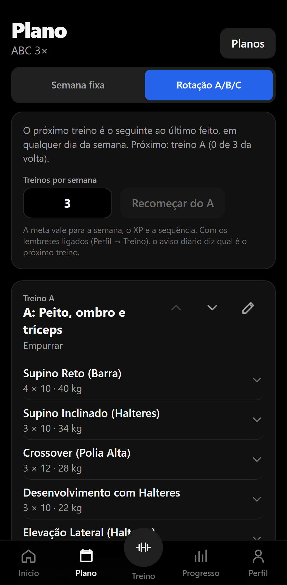
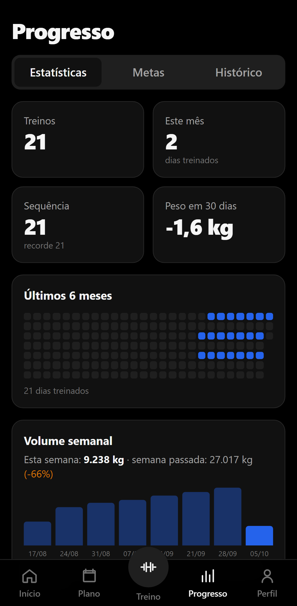
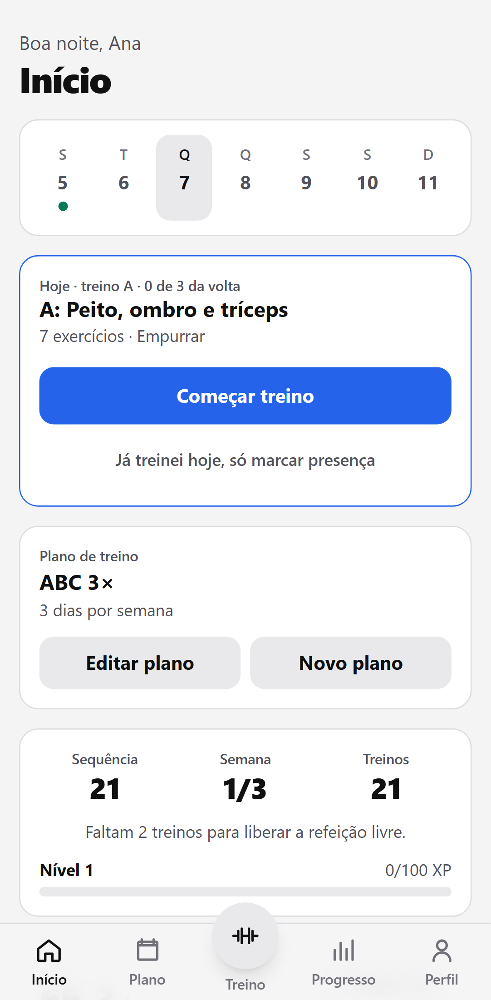

# Treino Personalizado

App de treino de academia, em português, para registrar séries e cargas e ver a evolução. Funciona
offline, não tem anúncios nem cadastro, e os dados ficam no seu aparelho.

<p align="center">
  
  
  
</p>

## O que o app faz

- **Plano de treino** por dia da semana ou em **rotação A/B/C**: na rotação, o próximo treino é o
  seguinte ao último feito, em qualquer dia. Modelos prontos (corpo inteiro, em casa, ABC,
  superior/inferior, Push/Pull/Legs, força 5×5) ou montado com ajuda de uma IA.
- **Treino guiado:** séries com carga e repetições, descanso com alarme (inclusive com a tela
  bloqueada no Android), aquecimento, troca de exercício, ilustração de cada exercício e
  calculadora de anilhas.
- **Progressão automática de carga:** o treino abre com a carga sugerida pelo histórico e uma
  linha dizendo o porquê ("+2,5 kg: 12 reps nas 3 séries"). Dá para preferir a carga da última vez
  ou a do plano.
- **Evolução:** recordes por 1RM estimado, gráfico por exercício, volume semanal, séries por
  grupo muscular e mapa de calor dos últimos meses.
- **Peso e saúde:** pesagens com meta, IMC, metabolismo basal, gasto diário e água.
- **Motivação:** sequência de treinos, níveis, XP e conquistas.
- **Seus dados:** backup em arquivo (com senha opcional) e backup automático no Android.
- Tema claro e escuro, e gestos para apagar ou copiar séries.

<p align="center">
  
  
</p>

## Como usar

- **Android:** baixe o APK da [última versão](https://github.com/carlosmozart/Treino-Personalizado/releases/latest)
  e instale. O app avisa quando sai uma versão nova e confere o arquivo antes de instalar.
- **Navegador, inclusive no iPhone:** <https://carlosmozart.github.io/Treino-Personalizado/>.
  No iPhone, use Compartilhar → "Adicionar à Tela de Início" para abrir como app. No iPhone o
  alarme do descanso não toca com a tela bloqueada.

Os dados ficam só no aparelho. Em **Perfil → Dados e backup**, faça um backup de vez em quando e
guarde o arquivo em um lugar seguro, principalmente antes de trocar de celular.

## Novidades

O que mudou em cada versão está no [CHANGELOG.md](CHANGELOG.md). Dentro do app, as novidades
aparecem uma vez depois de cada atualização e ficam em **Perfil → Sobre → Novidades**.

## Desenvolvimento

O app fica na pasta [`app/`](app/): React 19, TypeScript, Tailwind 4 e Zustand, com Capacitor para
o Android. Requer Node.js 22 ou mais novo.

```bash
npm --prefix app ci
npm --prefix app run dev       # abre em http://localhost:5173
npm --prefix app run verify    # tipos, build e testes de unidade
```

Testes de navegador (sobre o build de produção) e capturas de tela deste README:

```bash
npm --prefix app run build
npx --prefix app playwright test
npm --prefix app run screenshots   # regrava docs/screenshots/ com dados fictícios
```

Documentação:

- [Arquitetura](docs/arquitetura.md) e [guia de interface](docs/guia-interface.md)
- [Modelo de dados](docs/dev/modelo-de-dados.md), [progressão de carga](docs/dev/progressao.md) e
  [rotação A/B/C](docs/dev/rotacao.md)
- [Build do Android](docs/android-apk.md) e [testes no aparelho](docs/testes-em-aparelho.md)
- Plano de trabalho: [TODO.txt](TODO.txt)

A raiz do repositório ainda guarda o app 2.x (`index.html` e `js/`), substituído pela versão 3 e
mantido só até ser arquivado.

## Créditos

As ilustrações dos exercícios são do [Everkinetic](https://github.com/everkinetic/data), de Greg
Priday, sob a licença [CC BY-SA 4.0](https://creativecommons.org/licenses/by-sa/4.0/deed.pt-br).
Detalhes em [docs/creditos.md](docs/creditos.md) e, no app, em **Perfil → Sobre → Créditos e
licenças**.
